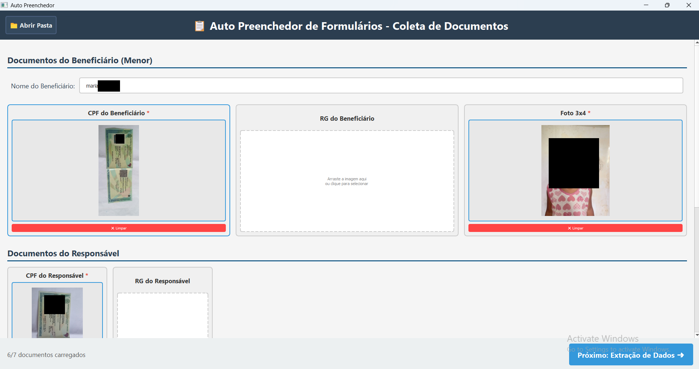
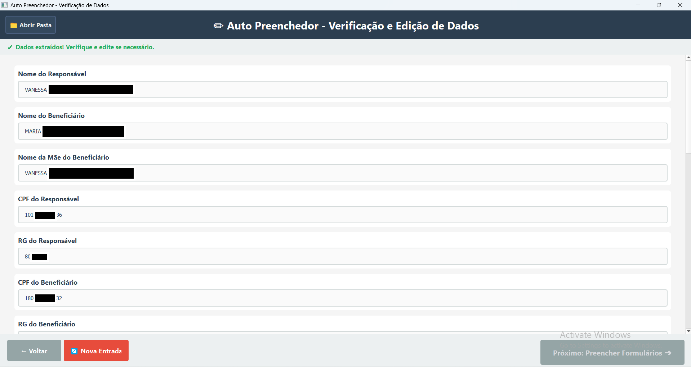
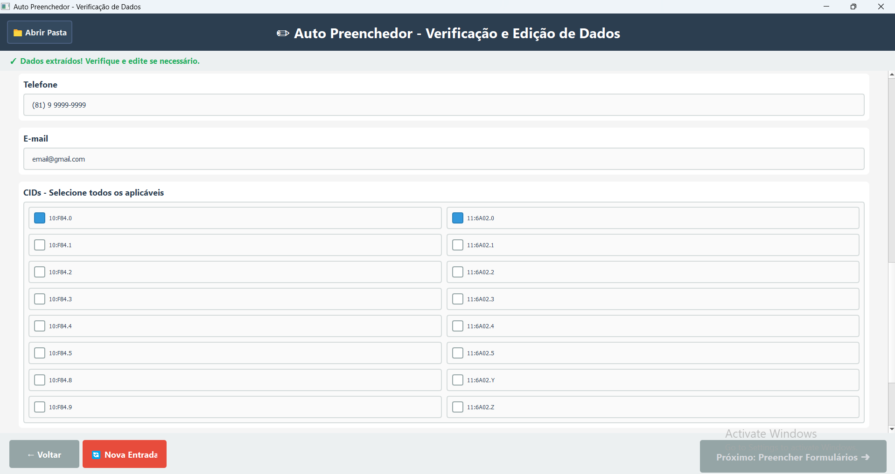
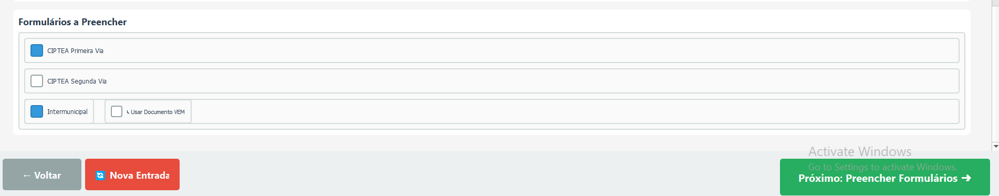
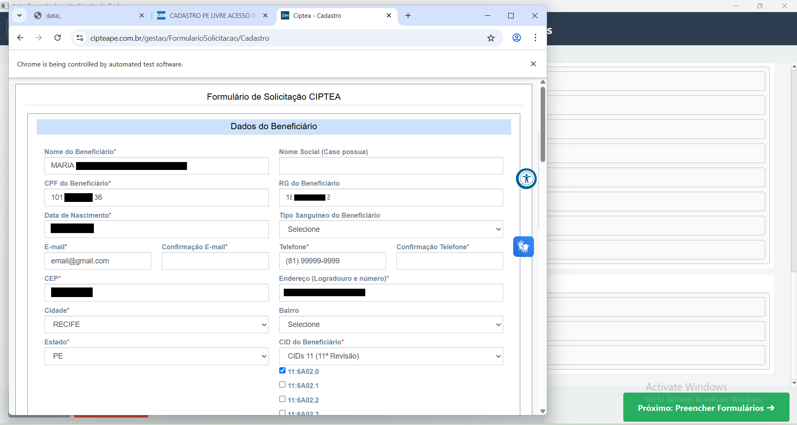
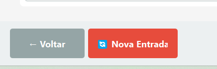
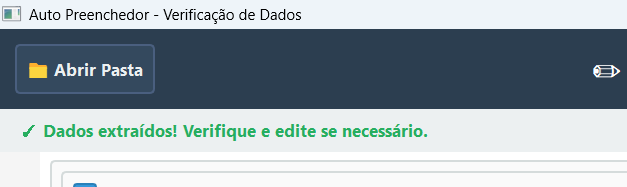

# Guia do Usuário - Auto Preenchedor

## 📋 O que é este programa?

O **Auto Preenchedor** preenche automaticamente formulários de CIPTEA e Passe Intermunicipal usando Inteligência Artificial. Você só precisa fornecer os documentos digitalizados!

---

## 📸 Documentos Necessários

Prepare fotos ou digitalizações dos seguintes documentos:

### ✅ Obrigatórios
- **CPF do Beneficiário** (menor de idade)
- **Foto 3x4** do beneficiário
- **CPF do Responsável**
- **Laudo Médico**
- **Comprovante de Residência**

### ⭕ Opcionais
- RG do Beneficiário
- RG do Responsável
- VEM (Vale Eletrônico Municipal)

> **💡 Dica:** Use o celular para tirar fotos claras dos documentos!

---

## 🚀 Passo a Passo

### Passo 1️⃣: Adicionar Documentos

1. **Abra o programa** (clique duas vezes no ícone)

2. **Digite o nome completo do beneficiário** no campo no topo

3. **Adicione os documentos:**
   - Arraste as fotos para as caixas correspondentes, **OU**
   - Clique nas caixas e selecione os arquivos

4. **Observe os asteriscos vermelhos (*)** - estes documentos são obrigatórios!

5. **Acompanhe o contador:** 
   - "5/8 documentos carregados" significa que você já adicionou 5 documentos

6. **Clique em "Próximo: Extração de Dados ➜"**

> **⚠️ Importante:** Não feche o programa enquanto estiver processando!

---

### Passo 2️⃣: Conferir e Corrigir os Dados

**O computador vai ler os documentos automaticamente!** Isso pode levar alguns minutos.

#### Aguarde enquanto o sistema:
1. ⏳ Organiza os documentos
2. ⏳ Lê os textos das imagens
3. ⏳ Preenche os campos automaticamente

#### Revise TODOS os dados:

**Dados do Responsável:**
- ✏️ Nome do Responsável
- ✏️ CPF (formato: 000.000.000-00)
- ✏️ RG

**Dados do Beneficiário:**
- ✏️ Nome do Beneficiário
- ✏️ Nome da Mãe
- ✏️ CPF (formato: 000.000.000-00)
- ✏️ RG
- 📅 Data de Nascimento (DD/MM/AAAA)

**Contato e Endereço:**
- 🏠 Endereço (Rua e Número)
- 📮 CEP (formato: 00000-000)
- 📱 Telefone (formato: (81) 9 9999-9999)
- 📧 E-mail

> **💡 Dica:** Os campos formatam sozinhos enquanto você digita! Os nomes ficam em MAIÚSCULAS automaticamente.

#### ⚠️ MUITO IMPORTANTE: Corrija qualquer erro!
O computador pode errar na leitura. **Confira tudo com atenção!**

---

### Passo 3️⃣: Marcar os CIDs

1. **Role a página para baixo** até ver "CIDs - Selecione todos os aplicáveis"

2. **Marque TODOS os CIDs** que aparecem no laudo médico
   - Lado esquerdo: CID-10 (F84.0, F84.1, etc.)
   - Lado direito: CID-11 (6A02.0, 6A02.1, etc.)

3. **Não tem certeza?** Olhe no laudo médico e marque exatamente o que está escrito lá

> **💡 Dica:** O programa tenta marcar automaticamente, mas sempre confira!

---

### Passo 4️⃣: Escolher os Formulários

Marque quais formulários você quer preencher:

#### 📋 CIPTEA Primeira Via
- ✅ Já vem marcado
- Use para: **Primeira carteirinha** do beneficiário

#### 📋 CIPTEA Segunda Via
- ⬜ Vem desmarcado
- Use para: **Renovar** ou pedir segunda via da carteirinha

#### 🚌 Intermunicipal
- ✅ Já vem marcado
- Use para: **Passe de ônibus intermunicipal**

#### 🎫 Usar Documento VEM
- ⬜ Só aparece se você marcou "Intermunicipal"
- Marque **SOMENTE** se você enviou o documento VEM no Passo 1

> **⚠️ MUITO IMPORTANTE:** Role até o FINAL da página! O botão "Próximo" só funciona quando você chega no fim.

---

### Passo 5️⃣: Preencher os Formulários

1. **Clique em "Próximo: Preencher Formulários ➜"**

2. **Aguarde!** O programa vai:
   - ⏳ Abrir o navegador
   - ⏳ Acessar os sites
   - ⏳ Preencher todos os campos
   - ⏳ Anexar todos os documentos

**Isso pode levar alguns minutos!**

3. **Quando aparecer a mensagem "Preenchimento Concluído":**
   - ✅ O navegador vai estar aberto com as páginas
   - ✅ A maioria dos campos estarão preenchidos
   - ✅ Todos os documentos anexados

4. **⚠️ MUITO IMPORTANTE - CONFIRA CADA CAMPO:**
   - ✏️ **Alguns campos podem ficar em branco** - o programa não consegue preencher todos automaticamente
   - 🔍 **Revise CAMPO POR CAMPO** em cada aba do navegador
   - ✏️ **Preencha manualmente** qualquer campo que estiver vazio
   - ✅ Verifique se os dados preenchidos estão corretos

5. **Só depois de conferir tudo, clique nos botões de enviar** em cada formulário

> **⚠️ ATENÇÃO:** O programa NÃO envia automaticamente! Você precisa clicar em "Enviar" em cada aba.
> 
> **⚠️ CAMPOS EM BRANCO:** É normal que alguns campos fiquem vazios. Preencha-os manualmente antes de enviar!

---

## 🔄 Começar Novo Preenchimento

Se você precisa preencher para outra pessoa:

1. Clique em **"🔄 Nova Entrada"** (botão vermelho)
2. Confirme que quer apagar tudo
3. Comece do zero!

> **⚠️ CUIDADO:** Isso apaga TUDO! Só clique se tiver certeza.

---

## 📁 Ver os Documentos Organizados

Quer ver onde ficaram salvos os documentos?

1. Clique em **"📁 Abrir Pasta"** (canto superior esquerdo)
2. A pasta vai abrir com:
   - ✅ Todos os documentos
   - ✅ Versões em PDF
   - ✅ Informações extraídas

**Localização:** `C:\Users\SeuNome\.auto_preenchedor_data\nome_do_beneficiario`

---

## ❗ Problemas Comuns

### "O botão Próximo não funciona!"

**Solução:** Role a página até o FINAL! O botão só fica verde quando você chega no fim.

---

### "Os dados estão errados!"

**Solução:** 
- ✏️ Corrija manualmente digitando nos campos
- 📸 Da próxima vez, tire fotos mais claras dos documentos

---

### "Faltam documentos!"

**Solução:**
- 🔴 Verifique se enviou todos com asterisco vermelho (*)
- ✅ Os sem asterisco são opcionais

---

### "O programa travou!"

**Solução:**
- ⏳ Aguarde pelo menos 5 minutos
- 🔄 Se realmente travou, feche e abra novamente
- 📁 Seus dados ficam salvos na pasta

---

### "Não consigo anexar o VEM!"

**Solução:**
- ✅ Certifique-se que adicionou a foto do VEM no Passo 1
- ✅ Marque a opção "↳ Usar Documento VEM" no Passo 4
- ✅ Só funciona se "Intermunicipal" também estiver marcado

---

## 💡 Dicas Importantes

### 📸 Para Fotos Melhores:
- ✅ Use boa iluminação
- ✅ Deixe o documento reto
- ✅ Tire foto de cima (não de lado)
- ✅ Certifique-se que dá para ler tudo
- ❌ Evite sombras e reflexos

### ⚠️ Antes de Enviar:
- ✅ Confira TODOS os dados
- ✅ Verifique CPF (muito importante!)
- ✅ Confira data de nascimento
- ✅ Revise endereço completo
- ✅ Verifique se os CIDs estão corretos

### 🔒 Segurança:
- ✅ Não compartilhe seus documentos
- ✅ Guarde os originais em lugar seguro
- ✅ Confira os dados antes de enviar

---

## 📞 Precisa de Ajuda?

Se tiver dúvidas ou problemas:

1. Leia esta seção de **Problemas Comuns** novamente
2. Peça ajuda para quem instalou o programa
3. Não tente mexer em configurações se não souber!

---

## ✅ Checklist Rápido

Antes de começar, certifique-se que tem:

- [ ] Fotos claras de TODOS os documentos obrigatórios
- [ ] Nome completo do beneficiário
- [ ] Laudo médico em mãos (para conferir os CIDs)
- [ ] Tempo para conferir tudo com calma
- [ ] Internet funcionando

---

**Pronto para começar? Abra o programa e siga o Passo 1! 🚀**

---

*Desenvolvido para facilitar sua vida ❤️*
